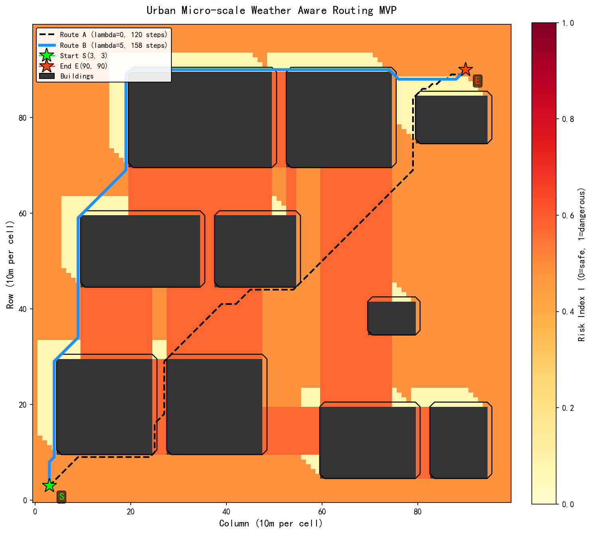

# Low-Altitude Weather-Aware Routing MVP

A minimum viable product for intelligent low-altitude weather risk avoidance pathfinding. This MVP uses synthetic data to validate the core algorithm logic without relying on external geographic data or real weather APIs.

## Project Structure

```
├── mvp_environment.py      # Virtual city DEM and meteorological constants
├── mvp_risk_model.py       # Wind downscaling and risk index computation
├── mvp_astar.py            # A* pathfinding with weather-aware cost function
├── mvp_visualization.py    # Final comparison visualization
├── CLAUDE.md               # Development configuration
├── dem_heatmap.png         # Virtual city elevation heatmap
├── wind_field.png          # Flight-altitude wind speed field
├── risk_heatmap.png        # Composite risk index heatmap
├── astar_comparison.png    # Side-by-side route comparison
└── mvp_result.png          # Final result visualization
```

## Environment

- **Python 3.13+** (Anaconda recommended)
- **Dependencies**: `numpy`, `matplotlib`

```bash
pip install numpy matplotlib
```

## Quick Start

Run each module in order:

```bash
# Step 1: Generate virtual city DEM and meteorological constants
python mvp_environment.py

# Step 2: Compute wind field and risk index
python mvp_risk_model.py

# Step 3: Run A* pathfinding (two routes)
python mvp_astar.py

# Step 4: Generate final comparison visualization
python mvp_visualization.py
```

Or run only the final visualization (it will compute everything automatically):

```bash
python mvp_visualization.py
```

## Core Logic

### 1. Virtual Environment (`mvp_environment.py`)

- 100x100 grid (10m per cell, 1km x 1km total)
- 10 buildings (35m ~ 100m height) with 4 narrow streets to simulate canyon effects
- Background wind: V10 = 6.0 m/s, direction = 45 deg (NE wind)
- Scalars: cloud base 500m, visibility 1000m, precipitation 2.0 mm/h

### 2. Risk Model (`mvp_risk_model.py`)

**AHP Weights** (preset, skipping consistency check):

| Factor | Wind | Cloud Base | Visibility | Precipitation |
|--------|------|------------|------------|---------------|
| Weight | 0.5  | 0.1        | 0.2        | 0.2           |

**Wind Downscaling**:
- Vertical correction: V10 -> V80 via power law (alpha = 0.3)
- Wake zones: 1-5 cells downwind of buildings, speed x 0.6
- Canyon/chimney effect: gaps between buildings aligned with wind, speed x 1.5

**Risk Index**:
- Wind normalization: < 8 m/s -> 0, > 12 m/s -> 1 (linear)
- Combined with weighted meteorological factors
- Buildings: risk = infinity (impassable)

### 3. A* Pathfinding (`mvp_astar.py`)

- 8-directional movement (cardinal + diagonal)
- Cost function: `G = euclidean_distance + lambda * risk[r, c]`
- Heuristic: euclidean distance to goal
- Lambda = 0 (traditional) vs Lambda = 5 (weather-aware)

### 4. Results

| Metric | Route A (lambda=0) | Route B (lambda=5) |
|--------|--------------------|--------------------|
| Steps | 120 | 158 |
| Total distance | 1418m | 1657m |
| Cumulative risk | 55.90 | 24.15 |
| Max single-step risk | 0.5775 | 0.4770 |
| **Risk reduction** | - | **56.8%** |
| **Distance overhead** | - | **16.9%** |

Route B trades 17% more distance for a 57% reduction in cumulative weather risk.

## Visualization



- **Background**: Risk heatmap (YlOrRd, green = safe, red = dangerous)
- **Dark blocks**: Buildings (impassable)
- **Black dashed line**: Route A (traditional shortest path)
- **Blue solid line**: Route B (weather-aware path)
- **Green star**: Start point S(3,3)
- **Red star**: End point E(90,90)

## License

MIT
